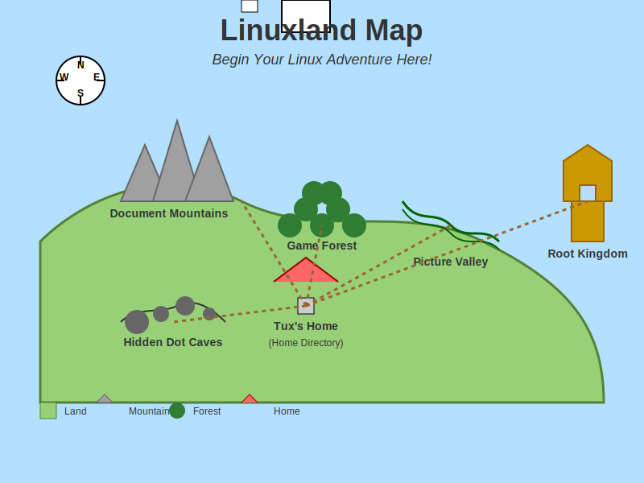

# Welcome to Linuxland!

[← Back to Main Index](../index.md)



## The Story Begins...

Once upon a time, in a magical kingdom called Linuxland, there lived a curious 8-year-old explorer named Tux. Tux had just received a special computer from Wizard Linus, the creator of the realm. But this wasn't just any computer! It didn't have colorful buttons to click like other computers. Instead, it had a mysterious black screen with glowing text where you had to type special magic words to make things happen!

"Don't worry," said Wizard Linus with a twinkle in his eye. "This is called a 'terminal', and it's where all the real magic happens in Linuxland! With the right commands, you can do amazing things that you never thought possible!"

Tux was both excited and a little nervous. "But how will I learn all these magic commands?"

The wizard smiled and handed Tux a magical map. "This map will guide you through the lands of Linux. Each adventure will teach you new commands and skills. By the end of your journey, you'll be a Linux wizard too!"

## How This Works

During each adventure:
1. Read the story and follow along with Tux
2. Learn new Linux commands as they appear in the story
3. Try the commands yourself in your terminal
4. Complete the fun challenges at the end of each story

Are you ready to begin your Linux adventure with Tux? Let's go!

## Your First Magic Word: `pwd`

Tux looked at the black terminal screen and asked, "But Wizard Linus, where am I in this computer world?"

The wizard nodded wisely and said, "To find your way in Linuxland, you must first know where you are. Try the magic words `pwd`, which stands for 'Print Working Directory'."

Tux carefully typed:

```bash
pwd
```

And amazingly, the computer showed the exact location in Linuxland where Tux was standing!

**Try it yourself!** Open your terminal and type `pwd` to see where you are in your computer's world.

## What's Next?

In our next adventure, Tux will learn how to look around and see what's nearby using the `ls` command!

[Click here to continue to the next adventure: Exploring Your Surroundings](01-exploring-your-surroundings.md)
