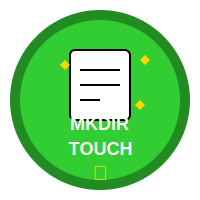
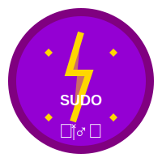

# Certificate of Achievement


```text
 _________________________________________________
|                                                 |
|           OFFICIAL CERTIFICATE OF               |
|               ACHIEVEMENT                       |
|                                                 |
|   This certifies that:                          |
|                                                 |
|   _____________________________________         |
|   (write your name here)                        |
|                                                 |
|   Has successfully completed all                |
|   adventures in Linuxland and has               |
|   mastered the following Linux commands:        |
|                                                 |
|   pwd, ls, cd, mkdir, touch, cp,                |
|   mv, rm, find, grep, and sudo                  |
|                                                 |
|   This young explorer is now officially         |
|   declared a:                                   |
|                                                 |
|   JUNIOR LINUX WIZARD                           |
|                                                 |
|   Signed,                                       |
|                                                 |
|   _____________________       _____________     |
|   Wizard Linus                Date             |
|_________________________________________________|
```

## Skill Badges Earned

Throughout your journey in Linuxland, you've earned these special badges:

### Navigation Master


```text
  🧭
 PWD
  CD
  LS
```

### File Creator



```text
  📝
 MKDIR
 TOUCH
  ✨
```

### Copy & Move Expert


```text
  📋
  CP
  MV
  🚚
```

### Careful Cleaner


```text
  🧹
  RM
  ⚠️
```

### Master Detective


```text
 🔍
 FIND
 GREP
 🕵️‍♂️
```

### Apprentice Wizard



```text
  ⚡️
 SUDO
 🧙‍♂️
```

## Next Steps for Your Linux Journey

Now that you've completed the basic training, you might want to:

1. Practice these commands every day to build your skills
2. Try the bonus challenges in each adventure
3. Create your own custom adventures with new directories and files
4. Share what you've learned with friends or siblings
5. Try advanced Linux commands when you're ready for new challenges

Remember: Learning Linux is a journey, not a destination. Keep exploring, keep learning, and keep having fun in Linuxland!

[Return to the Adventure List](index.md) | [Start the Adventures Over Again](adventures/00-welcome-to-linuxland.md)
