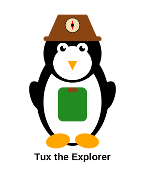
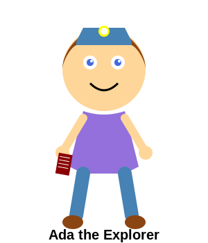
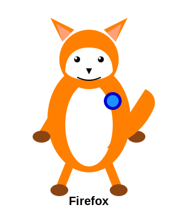
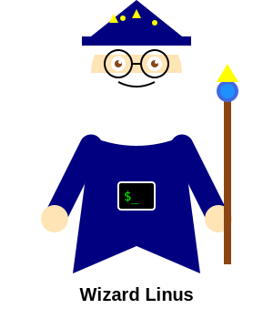
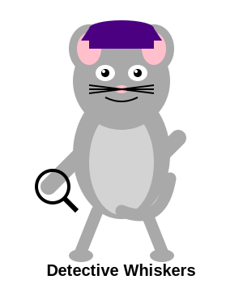
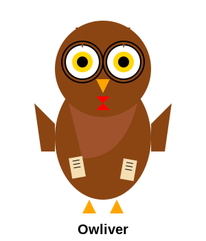
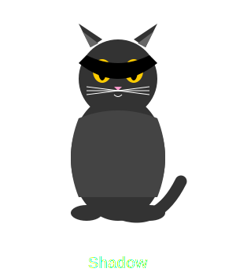
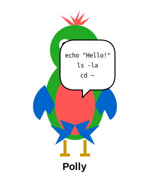

# Samarth Learning: Linux Adventures

Welcome to the magical world of Linuxland, where kids can learn Linux commands through exciting stories and adventures!

## Quick Navigation

[🚀 Start the Adventure!](adventures/00-welcome-to-linuxland.md) | [🏆 View Certificate of Achievement](certificate.md)

## Meet Our Characters

### Main Characters

|  |  |  |  |
|:---:|:---:|:---:|:---:|
| **Tux** | **Ada** | **Firefox** | **Wizard Linus** |
| A curious young penguin who's just beginning to explore Linuxland | A clever young explorer who shares helpful tips and tricks | A friendly fox who knows all the shortcuts around Linuxland | The wise creator of Linuxland who guides our young heroes |

### Friends Along the Way

|  |  |  |
|:---:|:---:|:---:|
| **Detective Whiskers** | **Owliver** | **Shadow** |
| A mouse detective who helps find lost things | A wise owl who knows all about Linux history | A mysterious black cat who teaches about permissions |

|  |  | |
|:---:|:---:|:---:|
| **Stella** | **Polly** | |
| A star guide who illuminates hidden features | A parrot who helps remember commands | |

## Adventures

Each adventure teaches new Linux commands in a fun, story-based format:

1. [Welcome to Linuxland](adventures/00-welcome-to-linuxland.md) - Introduction to the terminal and the `pwd` command
2. [Exploring Your Surroundings](adventures/01-exploring-your-surroundings.md) - Learning to see what's around with `ls`
3. [Moving Around Linuxland](adventures/02-moving-around-linuxland.md) - Navigating between folders with `cd`
4. [Creating Your Own Places](adventures/03-creating-your-own-places.md) - Making directories with `mkdir`
5. [Creating Magic Scrolls](adventures/04-creating-magic-scrolls.md) - Creating files with `touch`
6. [Copying Treasures](adventures/05-copying-treasures.md) - Using `cp` to copy files
7. [Moving Things Around](adventures/06-moving-things-around.md) - Using `mv` to move and rename
8. [Cleaning Up](adventures/07-cleaning-up.md) - Safely removing files with `rm`
9. [Finding Lost Treasures](adventures/08-finding-lost-treasures.md) - Search commands like `find` and `grep`
10. [Wizard Powers](adventures/09-wizard-powers.md) - Special commands with `sudo`

### Advanced Adventures (Coming Soon!)

1. Magical Pipes and Redirects - Connecting commands with `|`, `>`, and `>>`
2. Creating Spell Books - Writing shell scripts
3. The Book of Permissions - Understanding `chmod` and `chown`
4. Secret Messages - Text processing with `grep`, `sed`, and `awk`
5. Remote Castle Communication - Using `ssh` and `scp`

## How to Use This Guide

1. Start with the first adventure and progress in order
2. Read each story with your child
3. Help them try the commands in a real terminal
4. Complete the challenges together at the end of each adventure
5. Celebrate their progress as they become Linux wizards!

## Setting Up

To get the most out of these adventures, you'll need:

1. A computer with a Linux operating system (Ubuntu is a great choice for beginners)
2. A terminal program (which comes pre-installed on Linux)
3. An adult helper for the first few adventures

If you don't have Linux installed, you can:

- Use WSL (Windows Subsystem for Linux) on Windows
- Use Terminal on macOS (most commands work the same way)
- Try an online Linux terminal emulator

## Parents & Teachers

These adventures are designed to make learning Linux fun and approachable for children. Each story introduces commands gradually with child-friendly metaphors and plenty of practice opportunities. Feel free to adapt the stories to your child's interests or create your own Linux adventures!

The commands taught are safe for beginners, but adult supervision is recommended, especially for younger children or when using commands like `rm` that can delete files.

## Happy Exploring

Remember, in Linuxland, learning happens through exploration and play. Don't worry about making mistakes - they're part of the adventure! Just have fun and keep exploring!
